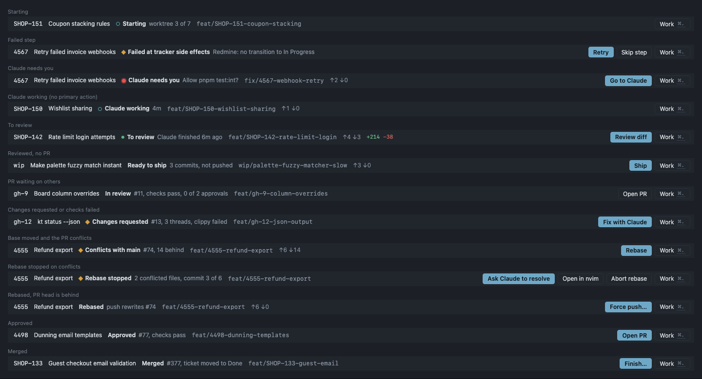
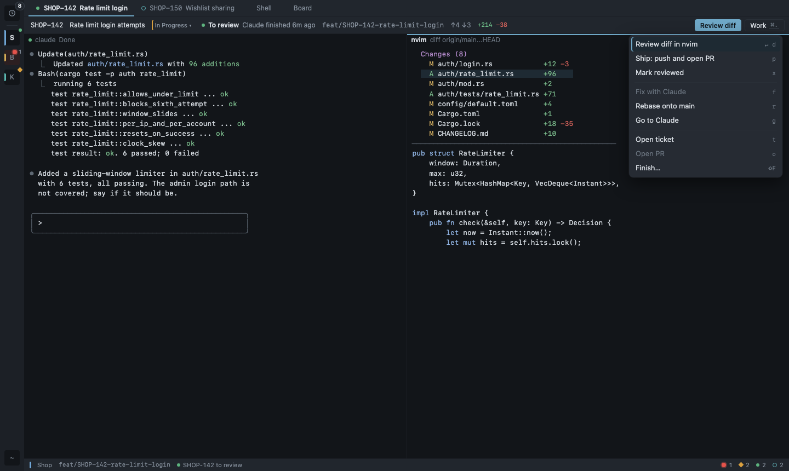
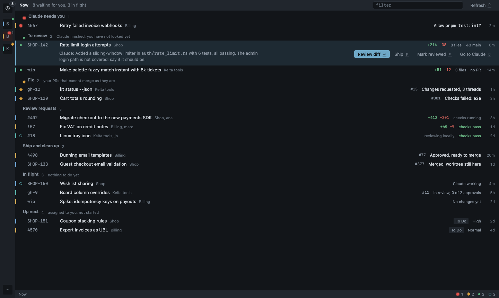
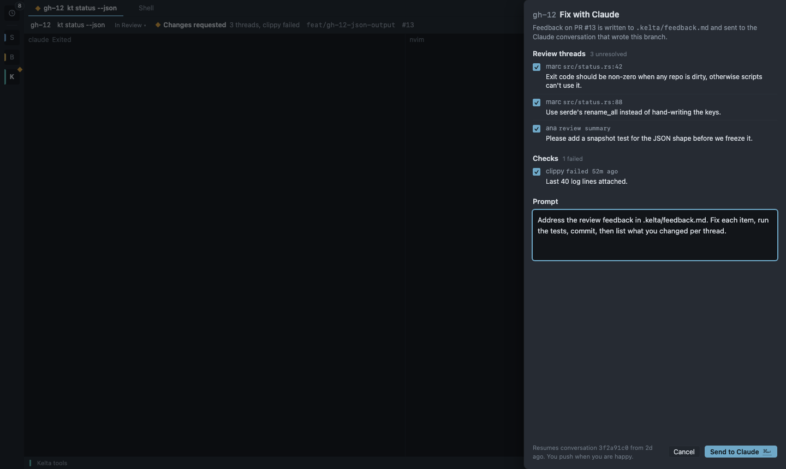
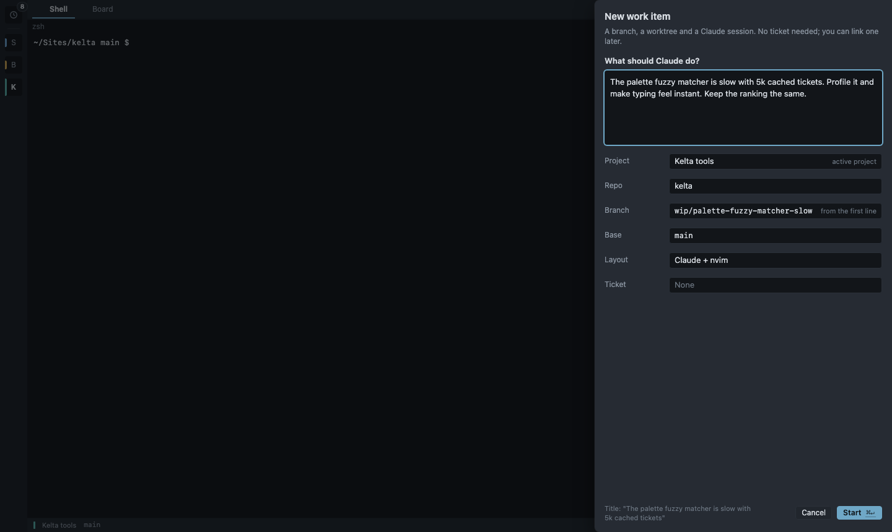

# Kelta flows

Status: accepted flow design for lane `flow-ux` (branch `feat/flow-ux`). It covers flows, structure, interaction and missing features. Visuals come from [DESIGN.md](DESIGN.md) (Bezel: lamps, project hue, row grammar) and are not redecided here.

Inputs: the flow audit on the mock UI (screenshots in `images/flow-audit/`, `a*` to `d*`) and a read of the backend at `316bc1d`. Mockups for this document are in `images/flow/` (source `mockups.html`, render with `node docs/images/flow/render.mjs`).

The four flows this design serves, in Louis's words:

1. **Basic**: take a ticket, launch Claude on it, then review the code in nvim or on GitHub.
2. **Feedback**: resume the previous Claude session, with its context, to fix what review found.
3. **Ticket-free**: explore a feature or fix a bug in a session that will probably end in a PR, without a ticket.
4. **Rebase** my work.

And the two questions behind them, asked many times a day with many things in flight: *what do I have to review, from other people and from Claude?* and *where am I in my own work?*

---

## 1. Principles

- **The work item is the unit of parallel work.** One branch, one worktree, one Claude conversation, at most one PR, with or without a ticket. Everything Louis does to his own code goes through a work item.
- **Every work item has exactly one next action**, derived from its state. The same action is `Enter` on its row in Now, the primary button in its work bar, and `⌘.` `Enter` from inside Claude or nvim. Learn one key, use it everywhere.
- **Now answers both questions on one screen**, across all projects, ordered by what to do next, one row per thing. No per-project hunting.
- **"Claude finished" is durable** until Louis acts on it. A glance at a tab never clears it.
- **Automatic when reversible, confirmed when destructive.** Reading state, fetching, moving a ticket after merge: automatic. Force push, removing a worktree: confirmed in one keystroke, never batched.
- **No polling.** State refreshes on events (hooks, `work.updated`, review polls that already exist), on window focus, and when Now opens.

---

## 2. The work item

### 2.1 Kinds

| Kind | Created by | Branch | Title | Claude prompt |
|---|---|---|---|---|
| Ticket | Start work on a ticket | `worktree.branch_template` | ticket title | `claude.prompt_templates.ticket` |
| Scratch (`WorkKind::Branch`) | New work item (`⇧⌘N`), `kelta-ctl start --task` | `work.scratch_branch_template`, default `wip/{slug}` (slug of the task's first line) | first line of the task, 72 chars max | `standalone`, default now `"{task}"` |
| Review | Review locally on someone else's PR | `kelta/pr-<n>` | PR title | `review` |

A scratch item behaves like a ticket item in every way except tracker side effects. It can be linked to a ticket later (§4.3).

Review locally on **my own** PR never creates a `kelta/pr-<n>` item: it resumes the work item that owns the PR, or, for a PR made outside Kelta, adopts the PR's head branch as a scratch item so pushes update the PR (§9, bug B2).

### 2.2 Phase: one derived state, one next action

`views/work/phase.ts` is a pure function, unit-tested, used by Now, the work bar, the status strip, the tab lamp and the palette:

```ts
phaseOf(item: WorkItem, claude: SessionInfo | null, pr: Review | null, git: GitStatus | null): Phase
// Phase = { id, label, detail, lamp, primary: WorkAction | null, section: NowSection }
```

The first matching row wins.



| # | Condition | Label (detail) | Lamp | Primary action | Now section |
|---|---|---|---|---|---|
| 1 | `state = failed` | Failed at {step} ({message}) | error | Retry {step} (Skip step beside it) | Fix |
| 2 | `state = starting` | Starting (step n of m) | working | none | In flight |
| 3 | `rebase.conflicts` non-empty | Rebase stopped (n conflicted files) | error | Ask Claude to resolve | Fix |
| 4 | Claude `needs_input` | Claude needs you (Claude's question) | needs input | Go to Claude | Claude needs you |
| 5 | Claude `working` | Claude working (for 4m) | working | none | In flight |
| 6 | `state = merged` | Merged (#n, ticket moved to Done) | none | Finish… | Ship and clean up |
| 7 | PR closed unmerged | PR closed (#n) | none | Finish… | Ship and clean up |
| 8 | PR `decision = changes_requested` on the current head, or `ci = failure` on the current head | Changes requested (n threads) / Checks failed (names) | error | Fix with Claude | Fix |
| 9 | PR `mergeable = false` | Conflicts with {base} (n behind) | error | Rebase | Fix |
| 10 | `review_due` | To review (Claude finished 6m ago) | done | Review diff | To review |
| 11 | `git.diverged` (rebased, PR exists) | Rebased (push rewrites #n) | none | Force push… | Ship and clean up |
| 12 | PR exists, `unpushed` | Unpushed (n commits) | none | Push | Ship and clean up |
| 13 | no PR, `ahead > 0` | Ready to ship (n commits) | none | Ship | Ship and clean up |
| 14 | PR approved, checks pass | Approved (#n) | none | Open PR (merge there) | Ship and clean up |
| 15 | PR open otherwise | In review (#n, checks, approvals) | none | Open PR | In flight |
| 16 | no PR, `ahead = 0` | No changes yet | none | Go to Claude | In flight |

Notes:
- "On the current head" (row 8): a changes-requested review left on an older commit means Louis already pushed a fix; the item waits for re-review (row 15) instead of nagging. Needs `Review.decision_head` (§8).
- `↓n` behind base is shown on every row and bar as meta, not as a phase. It only becomes a phase when the PR actually conflicts (row 9). Rebase stays one key away in the work menu.
- Review-kind items use rows 1-5, then "Reviewing #n" (primary: Open review, the detail pane where Approve lives), then "Reviewed" once `my_state` is not pending (primary: Finish…).

### 2.3 "To review": the durable signal for LLM work

`WorkItem.review_due: bool`, owned by kelta-work:

- **Set** when the item's Claude session fires a real `Stop` hook (`status_source = Hook`) and the worktree has changes Louis has not seen: `ahead > 0` or dirty. A Stop with no changes (Claude answered a question) does not set it.
- **Cleared** by: a `UserPromptSubmit` in that session (Louis answered Claude, so he looked), Ship or Push, Finish, and Mark reviewed (`x`). Opening the diff does not clear it: Louis may stop halfway.
- Heuristic sessions (hooks inactive) never set it: a 3 s quiet guess would flood the queue. The work bar shows the existing "status hooks inactive · Fix" instead.

The `done` lamp on a work item's tab, its project tile and the status strip comes from `review_due`, not from the session's `seen` flag. Plain sessions keep today's seen semantics.

### 2.4 Where a work item shows, always

| Place | What it shows |
|---|---|
| Tab | `[phase lamp] KEY title` (scratch: `wip title`). Mono key, lamp slot per DESIGN §6.3. |
| Work bar (tab header, above all panes, survives pane zoom) | key, title, ticket status menu, phase lamp + label + detail, branch, `↑a ↓b`, `+ins −del`, primary button, **Work ⌘.** menu. Mockup `f2-work-tab.png`. Clicking the phase label opens the existing `WorkItemPane` (saga steps, sessions) as a split down: this is the missing UI path to it. |
| Status strip | after the branch segment: `[lamp] KEY phase label`, for the focused session's work item. |
| Rail tile | aggregate lamp (DESIGN §6.2) folds in `review_due` and work-item errors, not just sessions. |
| Now | one row (§3). |
| Palette | Work items group (§3.5). |

`WorkItemHeader.svelte` becomes the work bar; no new pane type.



### 2.5 The work menu (`⌘.`)

`work.menu` opens a menu anchored to the work bar of the focused tab's work item, from any pane including terminals (it is a Mod chord, like `⌘K`). Single letters run actions; `Enter` runs the primary. Unavailable actions are listed but disabled with their reason in the tooltip, so the letters never move.

| Key | Action | Notes |
|---|---|---|
| `Enter` | primary action of the phase | |
| `d` | Review diff in nvim | §4.1 |
| `p` | Ship (push + PR) / Push / Force push… | one letter, wording follows the phase |
| `x` | Mark reviewed | only with `review_due` |
| `f` | Fix with Claude | needs a PR |
| `r` | Rebase onto {base} (or "Update from {base}" with `work.update_strategy = merge`) | |
| `g` | Go to Claude | focuses the Claude pane; resumes it if dormant |
| `l` | Link to ticket… | scratch items only |
| `t` / `o` | Open ticket / Open PR on the host | |
| `⇧F` | Finish… | always confirmed |

The same actions exist in the palette as "Work: …" commands for the focused item, so they are rebindable and searchable.

---

## 3. Now: the overview



Now replaces the Inbox. It keeps the Inbox's slot and plumbing (rail top tile, `⌘0`, `InboxHost`, action id `inbox.open`), so settings and keybindings do not break; only the label and contents change.

### 3.1 Sections

Each row is one *thing*: a work item, a session that is not part of a work item, a PR from someone else, or a ticket. A work item appears **once**, in the section of its phase (§2.2), never twice. Sections with no rows are not rendered. Order is the order to work in:

| Section | Lamp | Rows | Order within | Row `Enter` |
|---|---|---|---|---|
| Claude needs you | needs input | sessions in `needs_input` (work items and plain sessions) | longest waiting first | Go to Claude |
| To review | done | work items with `review_due` | oldest first, so nothing rots | Review diff |
| Fix | error | my work items in phase rows 1, 3, 8, 9; my PRs without a work item that have changes requested or failing checks | changes requested, checks failed, conflicts, failed steps | Fix with Claude / Rebase / Retry |
| Review requests | none (row lamp = local review Claude, if any) | PRs requesting my review with `my_state` pending, or a new head since my review | oldest first | Open review |
| Ship and clean up | none | phases 6, 7, 11-14, and reviewed review items | approved, unpushed, ready to ship, merged | per phase |
| In flight | working ring when Claude works | everything else that is mine and unfinished | latest activity first | Go to work tab |
| Up next | none | tickets assigned to me, not Done, with no unfinished work item; in-progress first, then tracker order; 10 max, then "Show all on Board" | | Start work |

The header reads `8 waiting for you, 3 in flight`. "Waiting" = the first four sections. The rail's Now tile badge shows the same number. The dock badge stays "sessions needing input" (interrupt level only).

### 3.2 Row grammar

DESIGN §6.8 row (`lamp | id | title | meta`) plus a 3px project-hue bar at the left edge (the raw project colour, as on rail tiles), so rows from many projects stay legible without grouping by project. The project name follows the title in 11px `--k-fg-subtle`. Scratch items show `wip` as their id.

Meta, right-aligned, tabular: the *reason* in `--k-fg` 12px (the one thing to read: "Changes requested, 3 threads", "Allow `pnpm test:int`?"), then diffstat or PR number, `↓n {base}` when behind, age.

The **selected row expands** to a second line: Claude's last message for Needs you and To review (`ClaudeMeta.preview`, already captured on Stop), the first unresolved thread for Changes requested, failing check names for Checks failed, and the row's actions as ghost buttons with their key. Nothing else ever expands; rows stay 26px in `VirtualList`.

### 3.3 Keys in Now

| Key | Action |
|---|---|
| `j` / `k` | move |
| `Enter` | the row's next action (table above) |
| `g` | go to the row's place without acting: work tab, session pane, review detail |
| `p` | Ship / Push on a work item row |
| `x` | Mark reviewed (To review rows) |
| `f` | Fix with Claude (Fix rows; on a PR without a work item, it first adopts the PR, §2.1) |
| `r` | Rebase |
| `s` | Start work (Up next rows) / Review locally (Review requests rows) |
| `o` | open on the host (PR) or tracker (ticket) |
| `n` | New work item |
| `/` | filter on id, title, project, branch |
| `R` | refresh |

Every action that leaves Now **closes Now and focuses the target in its project** (`ui.inboxActive = false`, activate project, focus tab and pane). Panes opened from Now use `new_tab` placement with reuse (one Reviews tab per project), never a split inside whatever tab happened to be active. This fixes bug B1.

### 3.4 Next waiting, without opening Now

`attention.next` (`⇧⌘U`) is renamed "Next waiting" and walks the first four sections of the Now queue in order, *going* to each row's place (like `g`), cycling on repeat. From there `⌘.` `Enter` runs the action. So the whole day can be driven as: `⇧⌘U`, look, `⌘.` `Enter`, repeat.

### 3.5 Palette

- New group **Work items**: every unfinished work item, `[lamp] KEY title` with the phase label as meta. Matches key, title, branch. `Enter` goes to it (`work_resume` recreates a closed tab and resumes Claude).
- Session rows that belong to a work item are named `KEY claude`, `KEY nvim` instead of three identical `claude` rows.
- New commands: New work item, Work: Review diff / Ship / Push / Fix with Claude / Rebase / Mark reviewed / Link to ticket / Finish (focused item), Update all work items from base, Finish all merged.

### 3.6 Freshness

- Opening Now and window focus call `work_status_all`: one `git fetch <remote> <base>` per repo (not per item), at most every 5 minutes, then ahead/behind/dirty/diffstat for every unfinished item in one call. This replaces per-tab `work_status` on focus.
- PR state comes from the existing authored and requested review polls. A PR that leaves the authored open list triggers one `get` to tell merged from closed.
- The header shows "as of 14:02" when any source is stale or offline, per existing `stale` flags.

---

## 4. Flows

Keystroke counts use macOS chords. Typing free text (a prompt, a search) counts as one action. `N` = rows to move past with `j`; `k` = tabs to move past.

### 4.1 Flow 1: ticket, Claude, review

1. `⌘0`, `j`×N to the ticket in Up next (or Board, or `⌘K` + key). `s`.
2. Start sheet (existing `StartWorkSheet`) with **Start focused**: `⌘↵`. Assign me, move to In Progress and the comment run after the sessions are up (existing saga). The new work tab opens and takes focus (mock must do this too, bug B5).
3. Claude works with the ticket file and the `ticket` prompt. The tab, tile and Now row show the working ring. Louis goes elsewhere.
4. Claude stops with changes: `review_due` is set. Desktop notification "SHOP-142 ready to review" if the tab is not visible. The item moves to **To review** in Now, with Claude's last message on the expanded row.
5. Review, either way:
   - **In nvim**: `Enter` on the row (or `⇧⌘U`, then `⌘.` `Enter`). `work_diff` opens a split in the work tab running `nvim` with `editor.review_args` rendered for this item (for example `-c "DiffviewOpen origin/{base}...HEAD"`), zoomed, cwd = worktree. Closing it returns to the Claude + nvim layout. With `review_args` empty, it opens a shell pane running `git diff origin/{base}...HEAD` through the user's pager. `review_args` now applies to own work items too, not only review items: one setting, one diff command.
   - **On GitHub**: `p` (Ship, §4.5) with Draft on. The PR opens in the browser with `o`. There is no "compare page without a PR": reviewing on GitHub means a (draft) PR.
6. Not happy: type into Claude (`g` then type). The prompt submit clears `review_due`; the next Stop sets it again. Happy: Ship. Ship clears it.

| | Before | After |
|---|---|---|
| Start | `⌘0`, `j`×N, `s`, click Start: 3+N | `⌘0`, `j`×N, `s`, `⌘↵`: 3+N, no mouse |
| Know Claude is done | green dot on a rail tile, cleared by any glance | durable To review row + badge |
| Open the diff | `⌘N` project, `⇧⌘]`×k, `⌥⌘→`, type `:DiffviewOpen origin/main...HEAD`: 4+k | `⌘0` `Enter`, or `⇧⌘U` `⌘.` `Enter`: 2-3 |
| Ship and open PR | Create PR, Create, Open PR: 3 clicks | `⌘.` `p` `⌘↵`, then `o` in the toast: 4 keys |

### 4.2 Flow 2: feedback into the previous Claude conversation

Trigger: a changes-requested review or a failed check on my PR. The item moves to **Fix** (row 8) as soon as the authored poll sees it; a notification already exists.

1. `⌘0`, the item is at or near the top of Fix. `Enter` (or `f`; or `⌘.` `f` from the work tab).
2. **Fix with Claude** sheet (`FixSheet.svelte`, mockup `f3-fix-sheet.png`):
   - `work_feedback` lists unresolved review threads (author, `path:line`, body), review summaries with a body, and failed checks with the last 40 log lines. All checked by default; uncheck to leave something out.
   - Prompt from `claude.prompt_templates.feedback`, editable, focused.
   - Footer names the conversation that will be resumed ("Resumes conversation 3f2a91c0 from 2d ago").
3. `⌘↵`: Kelta writes the checked items to `<worktree>/.kelta/feedback.md` and calls `work_send`:
   - Claude session live and idle (`done`, `waiting_user`): the prompt is pasted (bracketed) and submitted.
   - Claude session dead or tab closed: the tab is recreated (`work_resume`) and Claude starts as `claude --resume <claude_uuid> "<prompt>"`.
   - Claude `working` or `needs_input`: the send button is disabled with "Claude is working; send when it stops". Kelta never types into a permission prompt.
   

4. Claude fixes and stops: `review_due` → To review (§4.1 step 5). Then `⌘.` `Enter` = Push (phase row 12, no confirmation for a plain push). The item moves to In flight ("In review") until the reviewer reacts.

"Previous conversation" must really be the previous one. Today `WorkItem.claude_uuid` goes stale after `/clear` or an in-Claude `/resume` (bug B3). kelta-work now updates it from the hook-learned `session_id` of the item's Claude session (`SessionStart`, and any hook carrying a new id).

Claude can also pull feedback itself: MCP tool `get_review_feedback` returns the same content as markdown, so "check the review comments" works from inside Claude without the sheet.

Own PRs in the PR detail pane no longer offer Approve / Request changes; they offer **Fix with Claude** and **Go to work item**.

| | Before | After |
|---|---|---|
| Read the feedback | `⌘0`, `j`×N, `o`, read on GitHub | in the sheet |
| Get back to the right Claude | `⌘K`, type key, `Enter`, `s`, click Resume: 5, and possibly the wrong conversation after `/clear`; `s` on the PR row made a duplicate worktree | part of the same action |
| Hand over the feedback | copy-paste each comment: 2 per comment | 0 |
| Total | 8+N plus 2 per comment | `⌘0`, `j`×N, `Enter`, `⌘↵`: 3+N |

### 4.3 Flow 3: ticket-free (scratch) work

1. `⇧⌘N` anywhere (or `n` in Now, palette "New work item", `kelta-ctl start --task "…"`). **New work item** sheet (`NewWorkSheet.svelte`, mockup `f4-new-work.png`):
   - "What should Claude do?" textarea, focused. This text is the first prompt (`{task}` in `standalone`).
   - Project (active one), repo (only shown when the project has several), base, layout: prefilled, editable.
   - Branch: `wip/{slug}` from the first line, updated live while typing, editable. Validated with `git check-ref-format`.
   - Ticket: optional picker, default none.
   

2. `⌘↵`: same saga as ticket work minus tracker steps (`WorkSource::Branch{name, task}`). The work tab opens focused, Claude starts on the task.
3. From here it is a normal work item: To review, Ship (PR title = item title, body includes the task text), Fix, Rebase, Finish.
4. **Link to ticket** later (`⌘.` `l`, or palette): ticket picker over `tracker_search`, then `work_link`. The item becomes ticket-kind; the branch is never renamed. A checkbox (default on) applies `on_start` (assign me, move to In Progress), and if a PR exists, `on_pr` (move to In Review, comment the PR URL) and the ticket key is added to the PR title on the next Ship/Push only if the PR title has no key yet.

`⌘T` (New session) stays the way to open a plain session with no branch. Its sheet gets one line: "Want a branch and a PR? New work item ⇧⌘N". Promoting a running plain session into a work item is not offered (§11).

| | Before | After |
|---|---|---|
| Start an exploration | `⌘T`, template, project, directory, `Enter`: 5, in the main checkout, colliding with any other exploration | `⇧⌘N`, type, `⌘↵`: 3, own worktree and branch |
| Turn it into a PR | shell: `git switch -c`, `git push -u`, `gh pr create`: 3 typed commands | `⌘.` `p` `⌘↵`: 3 |

### 4.4 Flow 4: rebase

`⌘.` `r` (or `r` in Now, or primary action when the PR conflicts). `work_rebase{op: start}`:

1. **Preconditions**, each refused with the reason and a way out, never worked around:
   - Claude working or needing input in this worktree: "Claude is working in this worktree. Rebase when it stops."
   - Dirty tree: "3 uncommitted files. Commit or stash them first." [Ask Claude to commit] [Open shell].
2. Fetch `<remote>/<base>`, then `git rebase <remote>/<base>`. Sapling repos (`.sl` present): `sl pull`, `sl rebase -d <remote>/<base>`.
3. **Clean**: if the branch was never pushed, nothing else happens (phase back to Ready to ship / To review). If it was pushed, the phase is **Rebased** and the primary is **Force push…**.
4. **Conflicts**: the item records `rebase = {onto, conflicts, step, total}`. Phase row 3 "Rebase stopped", with:
   - **Ask Claude to resolve** (primary): `work_send` with `claude.prompt_templates.conflicts` (files, onto, step). Claude edits, `git add`s, runs `GIT_EDITOR=true git rebase --continue` until done, and is told not to push.
   - **Open in nvim**: opens the conflicted files in the item's nvim over RPC (`:args` the list, first file shown).
   - **Continue** (after resolving by hand) and **Abort rebase**.
   Kelta re-reads the rebase state on Claude Stop for that item, on window focus and after Continue/Abort.
5. **Force push…** dialog, always confirmed: "Rewrites `feat/4555-refund-export` on origin (PR #74). The lease checks origin is still at `a1b2c3d`." [Cancel] [Force push] (danger style). Runs `git push --force-with-lease=<branch>:<sha> <remote> <branch>` in a visible transient pane (same as today's push). Sapling: `sl push --to <branch> --force`.
6. `work.update_strategy = "merge"` (per project) replaces 2-5 with `git merge <remote>/<base>`, a plain push, and the label "Update from {base}". For teams that forbid force pushes.

**Bulk**: palette "Update all work items from base" rebases every unfinished item that is behind, clean and has an idle Claude, sequentially per repo after one fetch per repo. It never pushes. Result toast: "Rebased 4. Stopped on conflicts: 4555. Skipped: SHOP-150 (Claude working), gh-9 (uncommitted files)." Rebased items with a PR land in Ship and clean up with Force push… as their action, one confirmation each.

"Behind" is now computed against `<remote>/<base>` (bug B4: it was compared with the branch's own upstream after the first push, so it showed 0 forever).

| | Before | After |
|---|---|---|
| Know a rebase is needed | `↓n` on the focused tab only, wrong after first push | `↓n` on every row and bar; Fix row when the PR conflicts |
| Rebase, no conflicts, PR exists | `⌘D`, type `git fetch && git rebase origin/main`, type `git push --force-with-lease`: 3 | `⌘.` `r`, `⌘.` `Enter`, `Enter`: 5 keys, no typing |
| Conflicts | by hand, or explain them to Claude by hand | `⌘.` `Enter` |
| All 6 items in flight | 6 × the above | `⌘K`, "update all", `Enter`, then one confirmation per force push |

### 4.5 Ship

`⌘.` `p` (or `p` in Now, or primary in Ready to ship). The existing Create PR dialog, renamed **Ship**:

- Title prefilled (ticket: `work.pr.title_template`; scratch: item title), Draft toggle (default `work.pr.draft`), `⌘↵`.
- Dirty tree: "2 uncommitted files will not be in the PR." [Ask Claude to commit] [Ship anyway].
- No commits ahead: Ship disabled, "No commits ahead of main."
- Runs the existing `work_create_pr`: push (`git push -u`), find or create the PR, link it, `on_pr` (move ticket to In Review, comment the PR URL), clear `review_due`. Toast: "Opened PR #13" [Open].
- When Claude ships through MCP `create_pr`, it goes through the same `work_create_pr`, so the ticket moves and the item updates identically. Nothing to confirm in Kelta: Claude's own permission prompt is the confirmation.
- PR already exists: the same key is **Push** (plain push, no dialog) or **Force push…** (§4.4 step 5).

### 4.6 Merge, finish and clean up

- Merging happens on the host (Kelta has no merge button; the Approved phase's action is Open PR).
- When an authored PR leaves the open list, the poll asks the host for its state and publishes `pr.merged` or `pr.closed`. On `pr.merged`, kelta-work sets `state = merged` and applies `on_merge.transition_to` automatically (a tracker transition is reversible and was configured by the user). A failed transition shows in the phase detail; it does not block Finish.
- The item lands in **Ship and clean up** as "Merged". `Enter` opens the existing Finish dialog prefilled (stop sessions, remove worktree, delete local branch), `Enter` confirms. Dirty or unpushed worktrees keep today's "Force remove" danger path.
- "Finish all merged" (palette) shows one dialog listing the merged items with clean worktrees and finishes them on one confirmation. Dirty ones are listed as skipped. This is the only bulk destructive action, and it touches only work whose PR is merged.
- Review items finish the same way once I have reviewed (`my_state` not pending) or the PR is merged or closed.

| | Before | After |
|---|---|---|
| Notice the merge | on GitHub; the item stays PR open forever | Merged row in Now; ticket already moved |
| Clean up | `⌘N`, `⇧⌘]`×k, click Finish, confirm: 3+k | `⌘0`, `j`×N, `Enter`, `Enter`: 3+N |

### 4.7 Reviewing other people's PRs

- **Review requests** in Now, oldest first; a request comes back when the author pushes after my review ("updated since your review").
- `Enter`: the review detail opens in the project's Reviews tab (reused), Now closes (bug B1). Actions there: Approve, Request changes, Comment, Open on host, Review locally.
- `o`: open on the host.
- `s` (Now or detail), then `⌘↵`: review locally. Existing Review source: worktree on `kelta/pr-<n>`, `review` layout (Claude in plan mode with the `review` prompt, nvim with `review_args` diff, a shell with `git diff --stat`). The row stays in Review requests and shows the local Claude's lamp. The work bar's primary is **Open review** (the detail pane where Approve lives).
- After I submit a review, the row moves to Ship and clean up as "Reviewed", `Enter` = Finish (removes the review worktree).

---

## 5. Automatic or confirmed

| Action | Mode | Why |
|---|---|---|
| Fetch base, compute ahead/behind/diffstat | automatic, on Now open and window focus, 5 min floor per repo | read only |
| Set and clear `review_due`, phase changes | automatic | state |
| Update `claude_uuid` from hooks | automatic | state |
| Move ticket on start, on PR, on merge | automatic, per existing `work.on_*` settings | reversible, user-configured |
| Start work, new work item | confirmed by the sheet (`⌘↵`); `work.plan_preview = false` skips it for tickets | creates branch and worktree |
| Send feedback / conflicts to Claude | confirmed by the sheet or button | Louis sees exactly what Claude receives |
| Plain push, Ship | one key, Ship has a dialog for title and draft | non-destructive |
| Rebase | one key, refused when unsafe | local, `git rebase --abort` undoes it |
| Force push | always a dialog, never bulk | rewrites shared history |
| Finish | always a dialog; bulk only for merged + clean | deletes a worktree |

---

## 6. Error and blocked states

All follow DESIGN §6.13: one sentence saying what happened, one or two actions.

| Situation | Where | Message and actions |
|---|---|---|
| Start step failed | work bar, Fix row | "Failed at tracker side effects: Redmine has no transition to In Progress." [Retry] [Skip step] |
| Status hooks inactive | work bar | existing "status hooks inactive · Fix"; no To review signal for that item |
| Claude busy when sending feedback or conflicts | sheet button disabled | "Claude is working; send when it stops." |
| Previous conversation gone (`--resume` exits fast) | toast | existing fallback to `--continue`, then: "Previous conversation not found; Claude continued the latest one in this worktree." |
| Feedback fetch failed (token scope, offline) | Fix sheet | "GitHub refused the review threads (403: token lacks `pull_requests:read`)." [Open account settings] [Send without feedback] |
| Code host needs auth / offline | Now header | existing account banner; PR-based phases fall back to local phases and the header says "as of 14:02" |
| Rebase refused: dirty or Claude busy | toast with actions | §4.4 step 1 |
| Rebase fetch failed | dialog | "Could not fetch origin/main (offline)." [Rebase onto last fetched main] [Cancel] |
| Lease rejected on force push | push pane + toast | "origin/feat/x moved since your last fetch. Someone else pushed." [Fetch and show] — no retry, no plain `--force` |
| Plain push rejected (non-fast-forward) | toast | "origin has commits you do not have." [Rebase] |
| Ship with nothing to ship | Ship disabled | "No commits ahead of main." |
| Worktree deleted outside Kelta | work bar, In flight row | "Worktree missing at ~/…/SHOP-142." [Recreate] (re-enters the saga) [Finish] (drops the record) |
| PR closed without merge | Ship and clean up | "PR #13 closed without merge." [Finish…] [Open PR] |
| Sapling repo, unsupported operation | toast | "Not supported for Sapling repos yet: {op}." |

---

## 7. Keyboard map (new and changed)

| Action id | macOS | Linux | Prefix | Context |
|---|---|---|---|---|
| `inbox.open` (label "Open Now") | `⌘0` | `Ctrl+Shift+0` | `0` | global, unchanged chord |
| `attention.next` (label "Next waiting") | `⇧⌘U` | `Ctrl+Shift+U` | `u` | global, walks the Now queue (§3.4) |
| `work.new` | `⇧⌘N` | `Ctrl+Shift+N` | `w` | global |
| `work.menu` | `⌘.` | `Ctrl+Shift+.` | `.` | global, needs a focused work tab |
| `work.start` | `⌘↵` | `Ctrl+Enter` | `s` | unchanged; also submits every work sheet |

Now's single keys are in §3.3, the work menu's in §2.5. If `⌘.` turns out to be swallowed by macOS cancel handling in the webview, rebind it; the prefix key `.` always works. Check this first when implementing.

---

## 8. Backend gaps (minimal list)

Model (`kelta-proto`):
- `WorkItem`: `title: Option<String>`, `review_due: bool`, `rebase: Option<RebaseState{onto, conflicts: Vec<PathBuf>, step: u32, total: u32}>`.
- `WorkState::Merged`.
- `WorkSource::Branch{name, task: Option<String>}` (`name` may be empty: slug from task).
- `GitStatus`: `behind` against `<remote>/<base>`; new `diverged: bool`, `files`, `insertions`, `deletions` (vs merge base with base).
- `Review.decision_head: Option<String>` (commit the latest decisive review was left on).
- `Feedback{threads: Vec<{author, path?, line?, body_md, url}>, reviews: Vec<{author, state, body_md}>, failed_checks: Vec<{name, url, log_tail?}>}`.

Commands (`work_*`, all in `commands/work.rs`):
- `work_status_all{}` → `Map<WorkItemId, GitStatus>` (fetch once per repo, 5 min floor).
- `work_diff{id}` → opens the diff editor pane in the item's tab.
- `work_mark_reviewed{id}`.
- `work_feedback{id}` → `Feedback`.
- `work_send{id, prompt}` → resumes or writes into the item's Claude; `Conflict` when Claude is working or needs input.
- `work_rebase{id, op: start|continue|abort}`.
- `work_push{id, force_with_lease: Option<String /*expected sha*/>}`.
- `work_link{id, ticket, apply_side_effects: bool}`.
- `work_finish_merged{}` → finishes merged clean items, returns skipped ones.

CodeHost trait: `feedback(&ReviewRef) -> Feedback` (GitHub: GraphQL `reviewThreads(isResolved:false)`, latest reviews, failed check runs + job log tail; GitLab: unresolved resolvable discussions, failed pipeline jobs + trace tail), and a `state` (open/merged/closed) on `ReviewDetail`.

Events and listeners:
- Publish `pr.merged` (already declared) and new `pr.closed` when an authored PR leaves the open list.
- kelta-work listener on `claude.hook`: set/clear `review_due` (§2.3), update `claude_uuid` (B3). On `pr.merged`: `state = merged` + `on_merge.transition_to`.
- No new `UiEvent`: everything travels in `work.updated`.

MCP: `get_review_feedback` (markdown of `Feedback` for the session's work item).

kelta-ctl: `start --task "<text>" [--project <id>]`.

Settings: `claude.prompt_templates.feedback`, `claude.prompt_templates.conflicts`, `standalone` default `"{task}"`; `work.scratch_branch_template = "wip/{slug}"`; `work.update_strategy = rebase|merge`; key bindings `work.new`, `work.menu`. `editor.review_args` now also applies to own work items' diff.

Sapling: a small `Vcs` switch in kelta-work for rebase, continue, abort, conflict list (`sl resolve --list`) and push. Git first; Sapling in the same ticket as a second step.

---

## 9. Bugs fixed on the way

| Id | Bug | Fix |
|---|---|---|
| B1 | `Enter` in the Inbox (and on "Needs input" rows) never leaves the Inbox; the pane opens hidden as a split inside an unrelated tab ([b06](images/flow-audit/b06-inbox-enter-landed-as-split.png)) | §3.3: leave Now, `new_tab` with reuse |
| B2 | Review locally on my own PR creates a duplicate `kelta/pr-N` worktree and a fresh Claude ([b05](images/flow-audit/b05-s-on-own-pr-with-work-item.png)) | `existing_for` matches Review sources on `pr_url` and on repo + head branch; adoption of PRs made outside Kelta (§2.1) |
| B3 | `WorkItem.claude_uuid` goes stale after `/clear` or in-Claude `/resume`, so resume picks the wrong conversation | listener updates it from hooks |
| B4 | `behind` compares with the branch's upstream after the first push | compare with `<remote>/<base>` |
| B5 | Mock: `work_start` tab has no `work_item_id` and the wrong cwd, no `ui.open{focus}`; `work_plan` shows the planned branch instead of the existing item's | fix the mock so every phase in §2.2 can be shown and E2E-tested |

---

## 10. Tickets, in build order

Each ticket ships with mock support for its states and an E2E path on the mock; `bash scripts/ci-local.sh` is the gate.

1. **Navigation fixes**: B1, B5, palette Work items group and `KEY claude` session names. Small, unblocks the rest.
2. **Phase model and work bar**: `phase.ts` + tests, work bar (primary action, `⌘.` menu, phase → WorkItemPane), status strip segment, tab lamp. `work_status_all`, B4, `GitStatus` additions.
3. **To review**: `review_due` (model, listener, clear rules), Mark reviewed, `work_diff`, B3.
4. **Now**: sections, row grammar, expanded row, keys, badge, Next waiting.
5. **Scratch work items**: New work item sheet, `WorkSource::Branch{task}`, slug template, `kelta-ctl start --task`, Link to ticket, `⌘T` hint line.
6. **Feedback loop**: `CodeHost::feedback` (GitHub, GitLab), `decision_head`, `work_feedback`, `work_send`, Fix sheet, MCP `get_review_feedback`, own-PR detail actions, B2 and PR adoption.
7. **Rebase**: `work_rebase`, conflicts state and prompt, `work_push` with lease, Force push dialog, merge strategy, bulk update; then Sapling.
8. **Ship and finish**: Ship dialog rename and preconditions, `pr.merged` / `pr.closed`, `WorkState::Merged`, auto transition, Finish all merged.

---

## 11. Decisions

- **Now replaces the Inbox instead of adding a "My work" view.** The two questions are one question ("what do I do next?") and deserve one screen. A separate work list would show the same items without priority. The Inbox's slot, chord and action id are kept, so nothing Louis configured breaks.
- **One row per thing, placed by urgency, not grouped by project.** With many items in flight, grouping by project hides the order of work; the project-hue bar keeps "which project" readable at a glance.
- **One next action per work item, same key everywhere** (`Enter` in Now, primary button, `⌘.` `Enter`). This is the main keystroke saving and the main learning saving.
- **"To review" is a work-item flag owned by the backend, not a UI seen-state.** It must survive restarts and glances, and only real Stop hooks with real changes set it.
- **A work menu on `⌘.` instead of more global chords.** Global chords are scarce (SPEC §4 reserves most of the keyboard for terminals); one chord plus letters reaches every work action from inside Claude or nvim.
- **Feedback goes through a file plus a short prompt**, not a giant paste. `.kelta/feedback.md` is reviewable, survives a Claude restart, and keeps the prompt template short. Review comments are untrusted text: Louis sees them in the sheet before they reach Claude, and Claude's permission mode still applies.
- **Kelta never types into Claude while it is working or asking for permission.** A pasted prompt could answer a permission dialog.
- **Scratch items get `wip/{slug}` branches and keep them forever.** Renaming a branch with an open PR breaks the PR; linking a ticket later updates the tracker, not git.
- **Reviewing on GitHub means a draft PR.** A compare URL before pushing is not possible, and after pushing a draft PR is what Louis would open anyway. No `compare_url` in the CodeHost trait.
- **`editor.review_args` is the single diff setting** for both own work and others' PRs; empty falls back to `git diff` in a shell.
- **Rebase is the default update strategy, merge is a per-project setting.** Rebase keeps PRs readable; some teams forbid force push.
- **Force push is never bulk and never automatic; rebase can be bulk.** A local rebase is undoable, a rewritten remote branch may not be.
- **The ticket moves on merge automatically, the worktree is removed only on confirmation.** Matches "automatic when reversible".
- **Changes requested on an old head does not count.** Otherwise every fixed PR would sit in Fix until the reviewer returns.
- **Own PRs adopted by branch, not `kelta/pr-N`.** A local branch that is not the PR's head cannot update the PR.

### Not doing (and why)

- Promoting a running plain session into a work item: a live Claude cannot move to a new worktree, and `⇧⌘N` is as fast.
- Review threads in the PR detail pane: the Fix sheet is where they are acted on; reading them on the host remains one key (`o`).
- A merge button in Kelta, snoozing rows, per-project dashboards, priority drag-and-drop: nobody asked, and Now's order already encodes priority.
- Re-requesting review after a fix: the host does it on push for most setups; revisit if Louis misses it.
